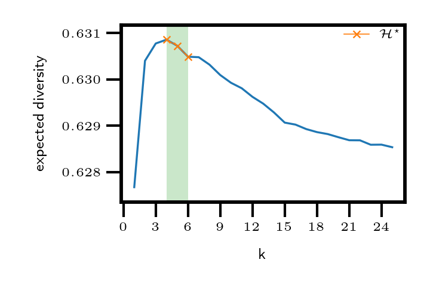
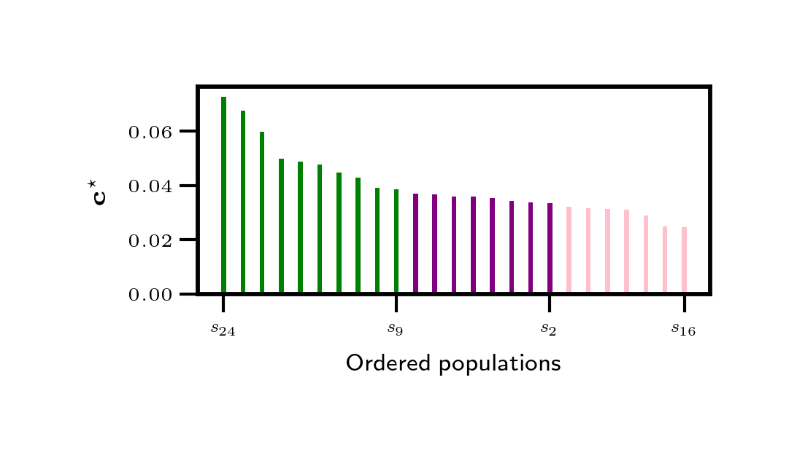

    
## Self-supervised Learning of Optimum Contributions: An Application in Maximizing Genetic Variation


<p align="center">
<picture>
  <source style="mix-blend-mode: luminosity;" media="(prefers-color-scheme: dark)" srcset="static/svdirs/dev-session/alle_frq_dirs/sthd_af/coan_plot.png" width="280">
  <source style="mix-blend-mode: luminosity;" media="(prefers-color-scheme: light)" srcset="static/svdirs/dev-session/alle_frq_dirs/sthd_af/coan_plot.png" width="280">
  
</picture>
<!-- <br clear="left"/> -->
<!-- <br clear="right"/> -->
<!-- <br clear="both"/> -->
<picture>
  <source style="mix-blend-mode: luminosity;" media="(prefers-color-scheme: dark)" srcset="static/svdirs/dev-session/alle_frq_dirs/sthd_af/relctrbs_sslplot.png" width="350">
  <source style="mix-blend-mode: luminosity;" media="(prefers-color-scheme: light)" srcset="static/svdirs/dev-session/alle_frq_dirs/sthd_af/relctrbs_sslplot.png" width="350">
  
</picture>
</p>

A self-supervised neural network algorithm for automatically choosing (or ranking) which populations $s_j$ out of a given $n>1$ populations should we sample broodstock from and in what relative proportions $\mathbf{c}^\star$, inorder to maximize genetic diversity (or minimize co-ancenstry) with the least diminishing returns in an offspring population. 

Input data is either a *set of populations that could be sampled from (with known allele frequencies at a common set of loci)*, or a *co-ancestry matrix*. The recommended $k$ number out of $n$ populations to combine are given in the set $\mathcal{H}_k\subseteq\mathcal{H}^\star$.

Developed with the application of creating base populations for aquaculture breeding programs in mind. In the first poster figure, it can be observed that out of a given $n=25$ populations, a $k$ in $[4,6]$ populations are recommended to minimize co-ancestry with the least diminishing returns. This respectively corresponds to a $84\\%$ and $76\\%$ reduction in redundancy. This removal of redundancy, would translate to savings in the monetary-cost and time involved with setting up a breeding program than when the whole $n=25$ populations were to be used. 

The second poster figure, shows the ordered ranking of populations by their relative contributions in the $25$-population set.


<details>
<summary>Motivation</summary>
Diversity of traits in living organisms is controlled by inherited genes. 
Therefore, the success of selective breeding tasks using genetic data predominant in the agricultural sciences is highly correlated with the degree of genetic variants present in the founding populations used for that breeding program. Today, genetic data can be digitally synthesized broadening the genetic variation range that can be obtained for founding a breeding program. A large number of populations, say $n \ge 50$ can now be surveyed as possible candidates that could be in the founder set.


Given a number of populations, $n$, we typically want to select $k\le n$ founding populations for a breeding program in a way that will maximize the genetic variation (or minimize the co-ancestry) of their offspring. For each $1 \le i\le n$ population, available information is a genomic dataset of allele frequencies for $l$ loci. 

</details>

<details>
  <summary>Problem Statement</summary>

  It is usually assumed that all available $n$ populations can be combined and sampled for use in the breeding program, that is, we choose $k=n$ populations. This plan was sensible about two decades ago when genotyping was expensive. In contrast, in recent times, large-scale genotyping data is cheaper to obtain.  However, choosing broodstock from all of the populations is likely redundant (diminishing returns).

  For optimum cost-effective planning, we would like to evaluate each possible $k$ founding set, where $1\le k\le n$, and pick a $k$ combination at which a further increase in $k$, starts to add little to the average genetic diversity in the group. For example, given a dataset of $n=20$ populations, we may find that choosing between $k=5$ to $k=8$ populations is sufficient to create a successful breeding program.

</details>

<details>
  <summary>Objective</summary>
  Here we present a self-supervised learning algorithm for efficiently solving large-scale problems of this nature. 
  
  Our tool assists with making the decision of which $k$ combination of the $n$ populations to choose and the relative proportion (or number) of broodstock from each? 
  
  Given known allele frequencies for $l$ loci in $n$ available populations. The goal of our learning algorithm is to both select a subset $k \le n$ populations and determine the relative proportion of individuals to select from each selected population in a way that maximizes the genetic variation of the given population-set, with the least diminishing return.
</details>

#### Installing
Clone this repo. From the root path of this repo on your local machine:

Install a python virtual environment (See: <a>https://packaging.python.org/en/latest/guides/installing-using-pip-and-virtual-environments/ </a>).

Install required python packages with the requirements.txt file `pip install -r requirements.txt`

#### Quick Test
A quick way to test the tool. Run: `python ssltest.py` from the main source-code directory.

#### Command Line Interface CLI
In a terminal window, we provide the command ``sslcmd``. 

Entering ``py sslcmd.py --help`` in the command window returns:

```
usage: sslcmd.py [-h] [-b BATCHSIZE] [-s SCALER] [-c MAXSTEPS] [-m NO_MAXSTEPS] (--files FILES [FILES ...] | --source_dir SOURCE_DIR | --coan_matrix COAN_MATRIX)

SSL CLI Tool!

options:
  -h, --help            show this help message and exit
  -b BATCHSIZE, --batchsize BATCHSIZE
                        batch-size (int)
  -s SCALER, --scaler SCALER
                        normalize data (bool)
  -c MAXSTEPS, --MAXSTEPS MAXSTEPS
                        upper limit on the total number of learning iterations (int)
  -m NO_MAXSTEPS, --NO_MAXSTEPS NO_MAXSTEPS
                        don't max-out the total number of learning iterations (bool)
  --files FILES [FILES ...]
                        list of source files
  --source_dir SOURCE_DIR
                        directory path to source files (on disk)
  --coan_matrix COAN_MATRIX
                        co-ancestry matrix path (on disk)
```
#### CLI Examples:

##### Example 1
- ``py sslcmd.py --source_dir ./alle_frq_dirs/test_af -b 256``

This tells the tool that the allele frequency data files are in a source directory located at './alle_frq_dirs/test_af' and configures the tool's data loader with a batch-size of 256.

##### Example 2
- ``py sslcmd.py --source_dir ./alle_frq_dirs/sthd_af -b 1``

This tells the tool that the allele frequency data files are in a source directory located at './alle_frq_dirs/sthd_af' and configures the tool's data loader with a batch-size of 1.

##### Example 3
- ``py sslcmd.py --coan_matrix ./coan_matrix_files/co_mat.txt``
- ``py sslcmd.py --coan_matrix ./coan_matrix_files/co_mat.npy``
- ``py sslcmd.py --coan_matrix ./coan_matrix_files/co_mat.npz``

These each passess in a file (*that can be loaaded with `numpy`*) containing a co-ancestry matrix of n populations to the tool.

#### Web Frontend
In a terminal, run: 
`
flask --app sslview --debug run --host=0.0.0.0  
`
to access the tool in form of a user-friendly web application.
<details>
  <summary> Quick Start (Web Frontend) </summary>
  <div>
      To start learning. Choose a configuration. Upload your genetic dataset of $n$ populations with allele frequencies. Header of dataset should be of the common form below: <br><br>
    <table>
      <thead>
        <tr>
          <th>CHROM</th>
          <th>POS</th>
          <th>N_ALLELES</th>
          <th>N_CHR</th>
          <th>{ALLELE:FREQ}</th>
        </tr>
      </thead>
    </table>
    where <strong>CHROM</strong> is a chromosome name, <strong>POS</strong> is a position (loci) in that chromosome, <strong>N_ALLELES</strong> is the number of alleles, <strong>N_CHR</strong> is related to the sample size that was used to calculate the allele frequencies, <strong>{ALLELE:FREQ}</strong> is the dictionary of alleles and their frequencies. 
    
Each line of the $n$ input files should have the same chromosome name and position for all populations. We adopt this particular format of input file, since it can be easily generated from common genotype file formats with existing, widely used software.
  
</div>
</details>

#### Acknowledgments
USDA-ARS AI-COE/SCINet Graduate Research Fellowship/Internship. 2023.

This research was supported in part by an appointment to the Agricultural Research Service (ARS) Research Participation
Program administered by the Oak Ridge Institute for Science and Education (ORISE) through an interagency agreement between
the U.S. Department of Energy (DOE) and the U.S. Department of Agriculture (USDA). ORISE is managed by ORAU under DOE
contract number DE-SC0014664.


